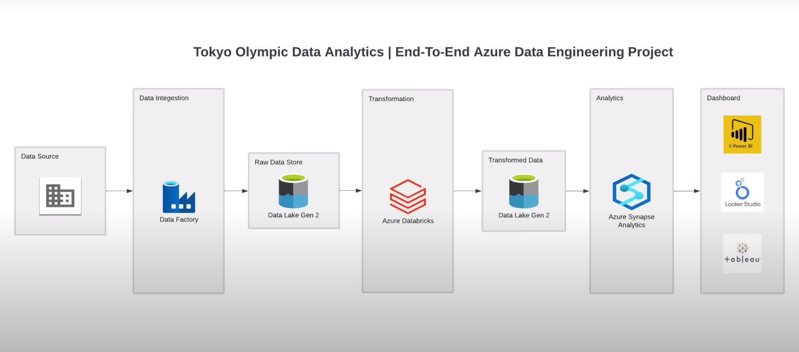

# Azure end-to-end Data Engineering Project | Tokyo Olympics Data

The project focuses on developing an end-to-end data engineering pipeline leveraging the Tokyo Olympics 2021 dataset. The pipeline is designed to ingest, transform and analyze dataset, with the ultimate gola of enabling comprehensive insights into the Olympic Games. 

Source(Kaggle): [Tokyo Olympics 2021](https://www.kaggle.com/datasets/arjunprasadsarkhel/2021-olympics-in-tokyo)

## Architecture
1. **Data Ingestion:** The data is initially ingested into Azure using Azure Data Factory.
2. **Storage:** Upon ingestion, the data is stored in Azure Data Lake Gen 2, providing a scalable and reliable storage solution. 
3. **Data Transformation:** Azure Databricks is utilized for transforming the ingested data. This step involves cleaning, aggregating and structuring the data for further analysis.
4. **Analytics:** Azure Synapse Analytics is employed for conducting analytics on the transformed data. Its powerful analytics capabilities enables in-depth exploration and visualization of the Olympic dataset. 
5. **Visualization:** The insights derived from the analytics can be visualized using either Power BI or Azure Synapse Analytics, offering intuitive and interactive visualization options.

